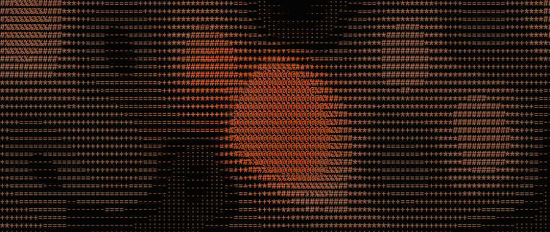

<div align="center">



# motes

**Procedural, pointer-reactive ASCII backgrounds for the web.**

Drop-in for React and vanilla. Zero runtime dependencies.

</div>

---

## Why this exists

The ASCII-on-the-web space splits into two camps.

Authoring tools export baked frames, so they cannot react to anything at
runtime. Procedural galleries animate from time alone — their render signature
is literally `render(time)`.

motes is `render(time, pointer)`. The cursor is a first-class input.

## Install

```sh
npm i @lucasmarkes/motes         # core, zero runtime dependencies
npm i @lucasmarkes/motes-react   # React wrapper
```

## Usage

```ts
import { createMotes } from '@lucasmarkes/motes'

const field = createMotes(canvas, { effect: 'flow', pointer: true })
field.start()
```

```tsx
import { Motes } from '@lucasmarkes/motes-react'

<Motes effect="flow" pointer className="fixed inset-0 -z-10" />
```

Sizing comes from CSS. Give the canvas a box and the field follows it, across
resizes and monitor-to-monitor DPI changes.

## The golden rule

The pointer interaction is an orthogonal layer that crosses every effect. It is
never an effect itself.

Adding an effect means writing one GLSL function:

```ts
import { defineEffect } from '@lucasmarkes/motes'

defineEffect('rain', {
  glsl: `
    float field(vec2 cell, float t) {
      float lane  = fract(sin(cell.x * 91.7) * 4321.0);
      float speed = 0.5 + lane * 1.1;
      float drop  = fract(cell.y * 0.05 - t * speed + lane * 7.0);
      float head  = smoothstep(0.0, 0.05, drop) * pow(1.0 - drop, 5.0);
      return head * (0.55 + lane * 0.45);
    }
  `,
})
```

That effect now reacts to the cursor. You wrote no pointer code.

The renderer assembles the fragment shader as `common → your field() → shared
pointer pass → main`, and the pointer contribution is added after `field()`
returns. An effect cannot see or override it — the orthogonality is structural,
not a convention, and there are tests that fail if it ever stops being true.

## Options

| Option | Default | What it does |
| --- | --- | --- |
| `effect` | `'flow'` | `'flow'`, `'waves'`, `'pulse'`, or your own. |
| `pointer` | `true` | Whether the field reacts to the cursor. |
| `radius` | `150` | Pointer influence radius, in CSS pixels. |
| `force` | `1.4` | Pointer force strength. |
| `speed` | `1.0` | Ambient animation speed multiplier. |
| `density` | `13` | Cell size in CSS pixels. Smaller is denser. |
| `charset` | `' .:-=+*#%@'` | Dark-to-bright glyph ramp. Index 0 must be a space. |
| `accent` | `'#d8531f'` | Colour the field intensifies toward. |
| `trail` | `0.3` | Phosphor persistence, 0 to 1. |

Every option is live: `field.set({ force: 2, effect: 'waves' })`.

## Copy-paste install

Prefer owning the code? The shadcn registry ships drop-in background
components — a base `<MotesBackground />` plus three preconfigured effects.

```sh
npx shadcn@latest add https://motes.lucasmarkes.com/r/motes-flow-background.json
```

See [`registry/README.md`](registry/README.md).

## How it works

One WebGL2 fragment shader over a full-screen triangle, plus a glyph atlas
rendered from your charset. Per fragment: resolve the cell, evaluate the
effect, add the shared pointer force, quantise to a glyph, sample the atlas,
and composite over the previous frame decayed toward the background.

Pointer events are read from the window and hit-tested against the canvas box,
so a field placed behind your content can carry `pointer-events: none` — it
never swallows a click, and still reacts as the cursor crosses whatever is
stacked on top.

The pointer smoothing is frame-rate independent, anchored so that 60Hz
reproduces the reference calibration exactly.

Requires WebGL2.

## Packages

| Path | Package | What it is |
| --- | --- | --- |
| `packages/core` | `@lucasmarkes/motes` | Renderer, effects, pointer layer |
| `packages/react` | `@lucasmarkes/motes-react` | `<Motes />` wrapper |
| `apps/playground` | — | Demo site |
| `registry/` | — | shadcn-compatible copy-paste items |

## Development

```sh
pnpm install
pnpm build
pnpm test
pnpm dev        # playground at localhost:5173
```

Publishing runs through a gate that builds, tests, packs, and inspects the
tarballs before printing the publish commands:

```sh
pnpm release    # checks only; never publishes
```

## License

MIT
